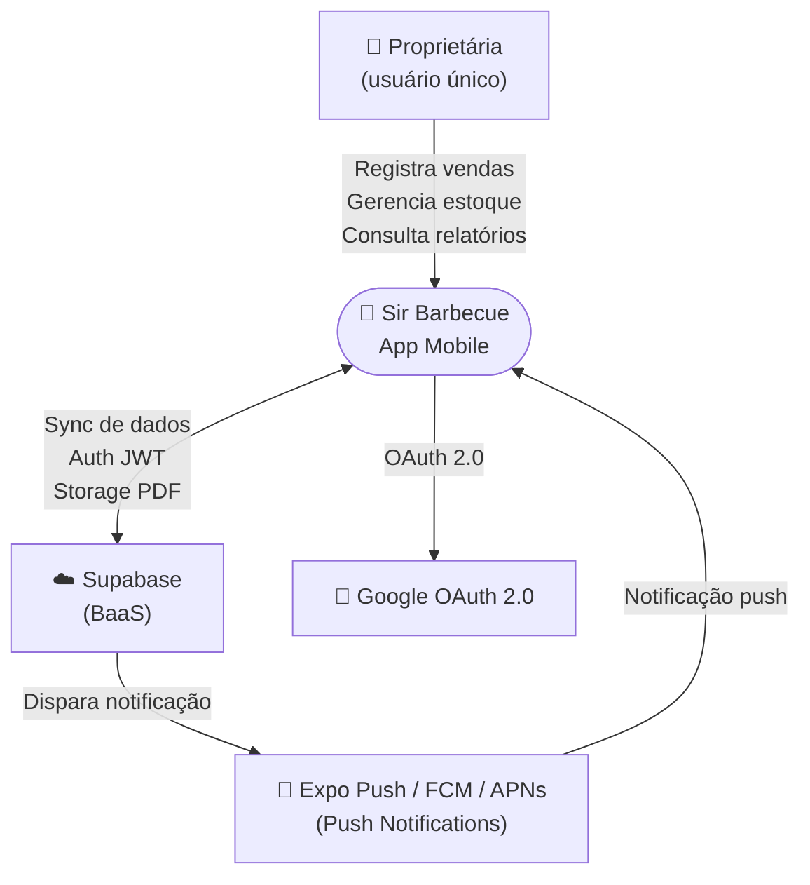
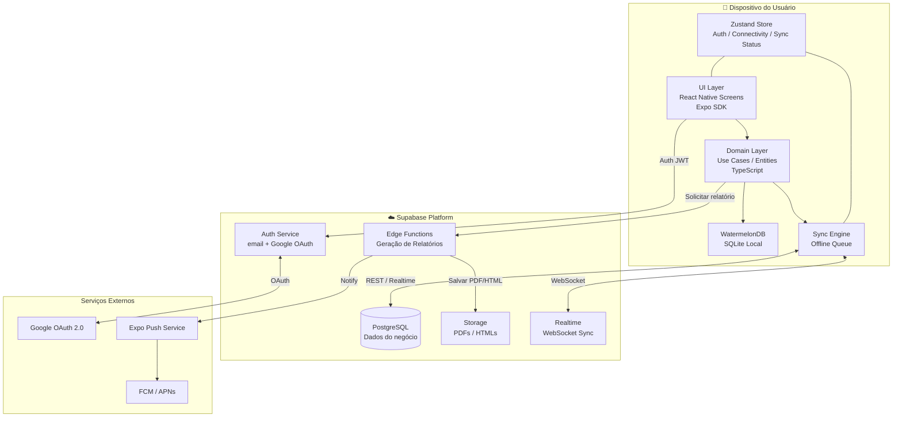
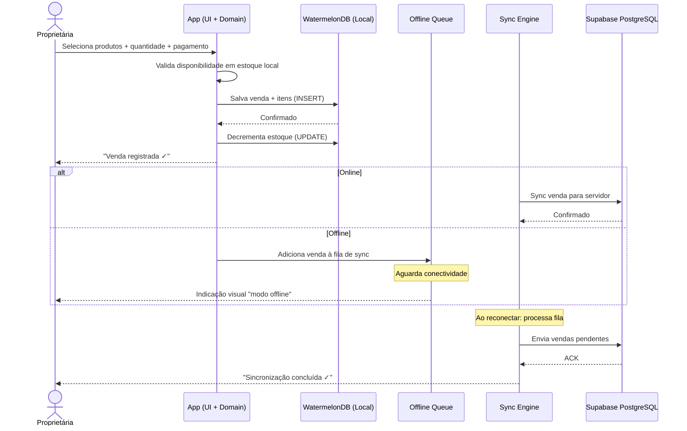
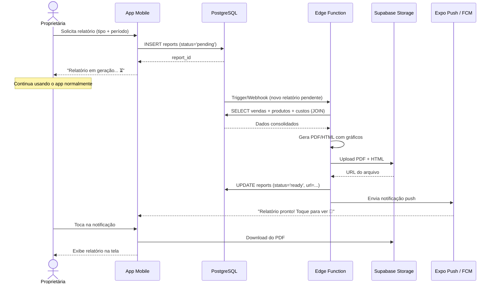

# Arquitetura de Software — Sir Barbecue

> **Fase:** 2 de 3 — Componentes, Diagramas e Design de APIs
> **Versão:** 1.1 (revisada para Expo SDK 55 em 19/06/2026 — ver [ANALISE_IMPACTO_EXPO_SDK_55.html](../plano/ANALISE_IMPACTO_EXPO_SDK_55.html))
> **Data:** 07/06/2026
> **Elaborado por:** Arquiteto de Soluções (gerado via /arquiteto-solucoes-sistema)
> **Baseado em:** Designing Data-Intensive Applications — Martin Kleppmann
> **Documento anterior:** [01a_ARQUITETURA_SOFTWARE_VISAO_GERAL.md](./01a_ARQUITETURA_SOFTWARE_VISAO_GERAL.md)
> **Próximo documento:** [01c_ARQUITETURA_SOFTWARE_INFRA_OPERACOES.md](./01c_ARQUITETURA_SOFTWARE_INFRA_OPERACOES.md)
>
> **Revisão 19/06/2026 — Expo SDK 55:** versões de libs e navegação atualizadas (Expo Router v7; download de relatório com a nova API `File`/`Directory` do `expo-file-system`). Base: [ANALISE_IMPACTO_EXPO_SDK_55.html](../plano/ANALISE_IMPACTO_EXPO_SDK_55.html).

---

## Índice desta Fase

4. [Componentes e Responsabilidades](#4-componentes-e-responsabilidades)
5. [Diagrama de Arquitetura](#5-diagrama-de-arquitetura)
6. [Design de APIs e Contratos](#6-design-de-apis-e-contratos)
7. [Comunicação entre Componentes](#7-comunicação-entre-componentes)

---

## 4. Componentes e Responsabilidades

### 4.1 Mobile App (React Native + Expo)

| Atributo | Valor |
|----------|-------|
| **Responsabilidade** | Interface do usuário, lógica de negócio local, persistência offline e orquestração de sync |
| **Tipo** | Frontend Mobile |
| **Tecnologia** | React Native 0.83.1, Expo SDK 55, TypeScript, WatermelonDB, Zustand |
| **Escala** | Stateful — o estado local (SQLite) reside no dispositivo |
| **Depende de** | Supabase (sync remoto), Expo Notifications, FCM/APNs |
| **Expõe** | Interface de usuário nativa iOS/Android |

**Principais Responsabilidades:**
- Apresentar todas as telas do sistema (Auth, Produtos, Fornecedores, Estoque, Vendas, Relatórios, Dashboard)
- Persistir dados localmente via WatermelonDB (SQLite) para operação offline-first
- Detectar estado de conectividade e acionar Sync Engine quando online
- Exibir notificações locais e gerenciar tokens FCM/APNs via Expo Notifications
- Gerar feedback visual de acessibilidade (VoiceOver/TalkBack, tamanho de fonte, contraste)

**Sub-componentes internos:**

| Sub-componente | Tecnologia | Responsabilidade |
|---------------|-----------|-----------------|
| Navigation | Expo Router v7 (sobre React Navigation 7) | Roteamento file-based entre telas — máx. 3 níveis de hierarquia (RNF-06) |
| Auth Module | Supabase Auth SDK | Login email/senha, Google OAuth, gestão de sessão JWT |
| Local Database | WatermelonDB (SQLite) | Persistência offline de todos os dados operacionais |
| Sync Engine | Custom + Supabase Realtime | Sincronização bidirecional com servidor |
| Notification Handler | Expo Notifications | Tokens push, recebimento e navegação por notificação |
| Report Requester | Supabase Functions SDK | Disparo e polling de status de geração de relatórios |
| PDF Viewer | react-native-webview + download via expo-file-system (nova API `File`/`Directory`) | Visualização e download de relatórios gerados (RF-23/24) |
| State Manager | Zustand | Auth state, connectivity state, sync status |
| Accessibility Layer | React Native Accessibility API | Labels para VoiceOver/TalkBack, tamanho mínimo de toque (48×48dp) |

---

### 4.2 Supabase Platform (BaaS)

| Atributo | Valor |
|----------|-------|
| **Responsabilidade** | Persistência durável na nuvem, autenticação, storage de relatórios, processamento assíncrono de relatórios e sincronização em tempo real |
| **Tipo** | Backend as a Service |
| **Tecnologia** | Supabase (PostgreSQL, Auth, Storage, Edge Functions, Realtime) |
| **Escala** | Gerenciado — Supabase escala automaticamente |
| **Expõe** | REST API, Realtime WebSocket, Storage HTTPS, Auth endpoints |

**Sub-componentes:**

| Sub-componente | Tecnologia | Responsabilidade |
|---------------|-----------|-----------------|
| PostgreSQL DB | PostgreSQL 15 | Armazenamento durável de todos os dados do sistema |
| Supabase Auth | GoTrue (JWT) | Autenticação email/senha + Google OAuth, tokens JWT |
| Supabase Storage | S3-compatible | Armazenamento de PDFs e HTMLs de relatórios gerados |
| Edge Functions | Deno + TypeScript | Geração assíncrona de relatórios (PDF/HTML), cálculos complexos de margem |
| Realtime | Phoenix Channels | Notificação de mudanças de dados para sync do app |
| Row Level Security | PostgreSQL RLS | Isolamento de dados por usuário — o proprietário só acessa seus dados |

---

### 4.3 Push Notification Pipeline

| Atributo | Valor |
|----------|-------|
| **Responsabilidade** | Enviar notificações push para o dispositivo quando eventos assíncronos ocorrem (relatório pronto, estoque baixo) |
| **Tipo** | Serviço externo gerenciado |
| **Tecnologia** | Expo Push Service → FCM (Android) / APNs (iOS) |

**Fluxo:** Edge Function → Expo Push API → FCM/APNs → Dispositivo do usuário

---

## 5. Diagrama de Arquitetura

> Diagramas em sintaxe Mermaid — renderizáveis no GitHub, GitLab, Notion e VSCode.

### 5.1 Diagrama de Contexto (C4 Level 1)



### 5.2 Diagrama de Containers (C4 Level 2)



### 5.3 Diagrama de Fluxo — Registro de Venda (Offline-First)



### 5.4 Diagrama de Fluxo — Geração de Relatório Assíncrono



---

## 6. Design de APIs e Contratos

> **Referência DDIA:** Cap. 4 — Kleppmann discute evolução de APIs sem quebrar compatibilidade. O Supabase expõe uma REST API auto-gerada a partir do schema PostgreSQL, complementada por Edge Functions para operações complexas.

### 6.1 Estratégia de API

**Abordagem:** Supabase auto-generated REST API + Edge Functions para lógica complexa

- Operações CRUD simples → Supabase REST API direta (auto-gerada via PostgREST)
- Operações com lógica complexa (geração de relatório, cálculo de margens) → Edge Functions
- Realtime (sync, dashboard) → Supabase Realtime WebSocket
- Autenticação → Supabase Auth endpoints

**Convenções:**
- Base URL Supabase: `https://<project>.supabase.co/rest/v1/`
- Edge Functions: `https://<project>.supabase.co/functions/v1/`
- Formato: JSON
- Autenticação: `Authorization: Bearer <jwt_token>` em todos os requests
- Row Level Security (RLS) garante que o usuário só acessa seus próprios dados

### 6.2 Endpoints por Domínio

#### Domínio: Produtos

| Método | Endpoint | Descrição | Cache Local |
|--------|----------|-----------|------------|
| GET | `/rest/v1/products?select=*` | Listar produtos (com categoria e config de dias) | Sim (WatermelonDB) |
| POST | `/rest/v1/products` | Criar produto | Invalida cache local |
| PATCH | `/rest/v1/products?id=eq.{id}` | Atualizar produto (preço, status, nome) | Invalida cache local |
| GET | `/rest/v1/categories?select=*,products(*)` | Listar categorias com produtos | Sim (WatermelonDB) |

**Payload — Criar Produto:**
```json
{
  "name": "Churrasquinho de Carne",
  "description": "Espetinho de carne bovina temperado",
  "price": 8.00,
  "category_id": "uuid-categoria-churrasquinho",
  "is_active": true
}
```

#### Domínio: Vendas

| Método | Endpoint | Descrição | Observação |
|--------|----------|-----------|------------|
| POST | `/rest/v1/sales` + `/rest/v1/sale_items` | Registrar venda | Operação em batch/transação |
| GET | `/rest/v1/sales?select=*,sale_items(*)&date=gte.{data}` | Listar vendas por data | Filtro por data no servidor |

**Payload — Registrar Venda:**
```json
{
  "sale": {
    "sale_date": "2026-06-07T19:30:00Z",
    "total_amount": 24.00,
    "payment_method": "pix",
    "consumption_mode": "on_site",
    "synced_at": null
  },
  "items": [
    { "product_id": "uuid", "quantity": 2, "unit_price": 8.00 },
    { "product_id": "uuid", "quantity": 1, "unit_price": 8.00 }
  ]
}
```

#### Domínio: Estoque

| Método | Endpoint | Descrição |
|--------|----------|-----------|
| GET | `/rest/v1/stock_items?select=*,products(name)` | Saldo atual por produto |
| POST | `/rest/v1/stock_entries` | Registrar entrada de estoque |
| GET | `/rest/v1/stock_entries?select=*,products(name)&order=created_at.desc` | Histórico de entradas |

#### Domínio: Relatórios (Edge Functions)

| Método | Endpoint | Descrição |
|--------|----------|-----------|
| POST | `/functions/v1/generate-report` | Solicitar geração de relatório (assíncrono) |
| GET | `/rest/v1/reports?id=eq.{id}` | Verificar status de relatório |
| GET | `/rest/v1/reports?select=*&order=created_at.desc` | Listar relatórios gerados |

**Payload — Solicitar Relatório:**
```json
{
  "type": "daily_sales",
  "period": {
    "start": "2026-06-07",
    "end": "2026-06-07"
  },
  "format": ["pdf", "html"]
}
```

**Tipos de relatório suportados:**
- `daily_sales` — Relatório diário de vendas por forma de pagamento (RF-17)
- `monthly_sales` — Relatório mensal consolidado (RF-18)
- `products_sold` — Relatório de produtos com custo e margem (RF-19)
- `financial_summary` — Relatório gerencial completo com ticket médio (RF-20)

**Resposta — Status do Relatório:**
```json
{
  "id": "uuid",
  "type": "daily_sales",
  "status": "ready",
  "pdf_url": "https://storage.supabase.co/...",
  "html_url": "https://storage.supabase.co/...",
  "created_at": "2026-06-07T20:00:00Z",
  "completed_at": "2026-06-07T20:00:45Z"
}
```

---

## 7. Comunicação entre Componentes

### 7.1 Comunicação Síncrona (Request-Response)

| De | Para | Protocolo | Quando Usar |
|----|------|-----------|-------------|
| App Mobile | Supabase Auth | HTTPS/REST | Login, logout, refresh token |
| App Mobile | Supabase REST API | HTTPS/REST | CRUD quando online |
| App Mobile | Supabase Edge Functions | HTTPS/POST | Solicitar geração de relatório |
| App Mobile | Supabase Storage | HTTPS/GET | Download de PDF gerado |
| Edge Function | Supabase PostgreSQL | Postgres direto | SELECT para geração de relatório |
| Edge Function | Expo Push API | HTTPS/POST | Notificar relatório pronto |

### 7.2 Comunicação Assíncrona (Event-Driven)

> **Referência DDIA:** Cap. 11 — Kleppmann discute sistemas de streaming e entrega de eventos. Para Sir Barbecue, usamos Supabase Realtime (baseado em PostgreSQL logical replication) como mecanismo de eventos.

| Producer | Canal/Evento | Consumer | Quando |
|----------|-------------|---------|--------|
| Supabase DB (trigger) | `reports:status_change` | App Mobile (Realtime) | Quando relatório muda para `ready` |
| Supabase DB | `stock_items:update` | App Mobile (Realtime) | Quando estoque é atualizado remotamente |
| Sync Engine (app) | Offline Queue | Supabase REST API | Ao reconectar, envia vendas pendentes |

### 7.3 Fluxo de Sincronização Offline

```
OFFLINE:
  Operação do usuário → WatermelonDB local (write) → marcado como "needs_sync"

RECONEXÃO DETECTADA:
  Sync Engine → lê todos os registros com needs_sync=true
  → para cada registro: POST/PATCH no Supabase
  → se 200 OK: marca needs_sync=false
  → se conflito: estratégia "client wins" para vendas; "server wins" para catálogo
  → ao concluir: Zustand store atualiza sync_status = 'synced'
  → UI exibe confirmação visual

ONLINE CONTÍNUO:
  Realtime WebSocket → recebe mudanças do servidor
  → Sync Engine aplica mudanças no WatermelonDB local
  → UI atualiza automaticamente via WatermelonDB observables
```

### 7.4 Estratégia de Retry

```
Tentativas: 3 (com backoff exponencial)
Backoff: 1s → 2s → 4s
Falha definitiva: operação fica na fila offline para próxima sincronização
Idempotência: todas as operações de write incluem client_id UUID gerado offline
  → servidor usa ON CONFLICT (client_id) DO NOTHING para idempotência
```

---

*Documento gerado via `/arquiteto-solucoes-sistema` — Claude Code Architecture Skill*
*Baseado em: Designing Data-Intensive Applications — Martin Kleppmann (1ª e 2ª ed.)*
