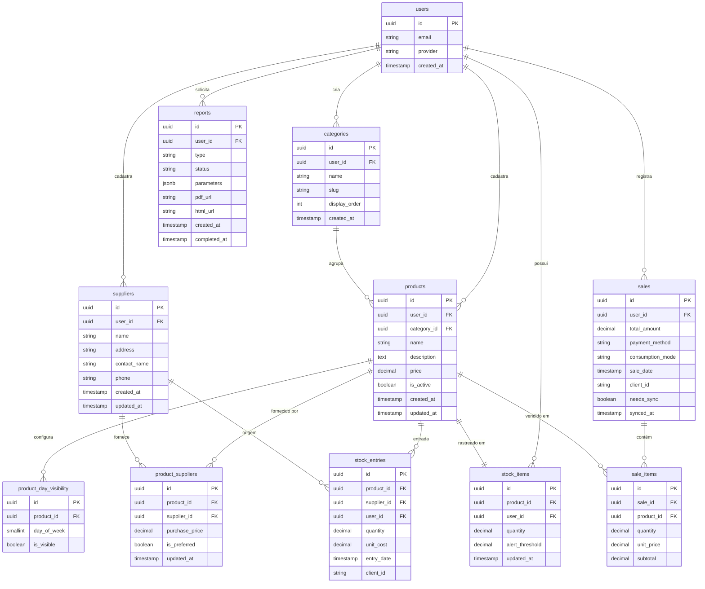

# Arquitetura de Banco de Dados — Sir Barbecue

> **Fase:** 1 de 2 — Análise de Dados, Seleção do BD, Modelo ER e Schema DDL
> **Versão:** 1.0
> **Data:** 07/06/2026
> **Elaborado por:** Arquiteto de Soluções (gerado via /arquiteto-solucoes-sistema)
> **Baseado em:** Designing Data-Intensive Applications — Martin Kleppmann
> **Próximo documento:** [02b_ARQUITETURA_BD_OPERACOES.md](./02b_ARQUITETURA_BD_OPERACOES.md)

---

## Índice desta Fase

1. [Análise de Requisitos de Dados](#1-análise-de-requisitos-de-dados)
2. [Seleção do Modelo de Banco de Dados](#2-seleção-do-modelo-de-banco-de-dados)
3. [Modelo de Dados — Entidades e Relacionamentos](#3-modelo-de-dados--entidades-e-relacionamentos)
4. [Schema do Banco de Dados — DDL Completo](#4-schema-do-banco-de-dados--ddl-completo)

---

## 1. Análise de Requisitos de Dados

> **Referência DDIA:** Cap. 1 — Kleppmann define sistemas data-intensive pelos padrões de acesso, não apenas pelo volume.

### 1.1 Características de Acesso aos Dados

| Característica | Análise | Impacto na Arquitetura |
|----------------|---------|----------------------|
| **Padrão de acesso** | Mixed — escritas frequentes (vendas) + leituras intensas (dashboard, relatórios) | Índices otimizados para consultas de relatório; write simples |
| **Volume de dados** | ~50 vendas/dia × 5 anos = ~91.000 vendas; < 50MB total estimado | Sem necessidade de particionamento em v1 |
| **Taxa de escrita** | ~5 operações/minuto no pico (hora do jantar) | Baixíssima — PostgreSQL suporta com folga |
| **Taxa de leitura** | Dashboard a cada 5 min + consultas manuais | Baixa — cache local cobre maioria das leituras |
| **Tamanho médio do registro** | Venda + 2-3 itens ≈ 500 bytes | Insignificante para sizing |
| **Dados históricos** | 5 anos (RNF-11) ≈ 91K vendas + 200K sale_items | Retenção total sem archiving necessário |
| **Consultas complexas** | JOINs para relatórios (vendas × produtos × custo de fornecedor) | Índices compostos nas colunas de JOIN + filtragem por data |

### 1.2 Entidades de Negócio Identificadas

| Entidade | Descrição | Registros Estimados (5 anos) | Criticidade |
|----------|-----------|------------------------------|-------------|
| `users` | Proprietária (auth data) | 1 | Alta |
| `categories` | Categorias de produto (Churrasquinho, Bebidas, etc.) | 4–10 | Baixa |
| `products` | Produtos cadastrados | 15–50 | Alta |
| `product_day_visibility` | Configuração de visibilidade por dia | 15–50 × 7 dias | Média |
| `suppliers` | Fornecedores | 5–20 | Média |
| `product_suppliers` | Relação produto ↔ fornecedor com preço de compra | 20–100 | Alta |
| `stock_items` | Saldo atual por produto | 15–50 | Alta |
| `stock_entries` | Histórico de entradas de estoque | ~500/ano × 5 = 2.500 | Alta |
| `sales` | Registros de venda | ~50/dia × 365 × 5 = 91.250 | Crítica |
| `sale_items` | Itens de cada venda | ~150/dia × 365 × 5 = 273.750 | Crítica |
| `stock_alert_config` | Configuração de alerta de estoque baixo por produto | 15–50 | Média |
| `reports` | Registros de relatórios gerados (metadados + URLs) | ~200 total | Média |

### 1.3 Requisitos de Consistência por Domínio

> **Referência DDIA:** Cap. 7 — Kleppmann explica que "ACID" tem significados diferentes em diferentes bancos.

| Domínio | Consistência Exigida | Justificativa |
|---------|---------------------|---------------|
| Registro de vendas | Forte (ACID) | Venda registrada deve garantir dedução de estoque atomicamente |
| Entrada de estoque | Forte (ACID) | Incremento de saldo deve ser atômico |
| Dados de catálogo (produtos) | Eventual (offline-first) | Edições de catálogo raramente conflitam; sync eventual é suficiente |
| Relatórios | Eventual (batch) | Relatório sobre dados passados; consistência eventual aceitável |
| Dashboard | Eventual | Cache de 5 min já aceita leve desatualização |

---

## 2. Seleção do Modelo de Banco de Dados

> **Referência DDIA:** Cap. 2 — Kleppmann compara relacional, documento, grafo, coluna-larga e time-series.

### 2.1 Banco de Dados Principal: PostgreSQL

**Recomendação:** PostgreSQL 15 (via Supabase)

**Modelo:** Relacional

**Justificativa:**

| Critério | Avaliação | Pontuação (1-5) |
|----------|-----------|-----------------|
| Consistência ACID nativa | Sim — transações completas | 5 |
| Suporte a JOINs complexos | Excelente — necessário para relatórios com custo/margem | 5 |
| Escalabilidade horizontal | Supabase cuida do scaling | 4 |
| Latência de leitura | Baixa — leituras via cache local | 5 |
| Maturidade e ecossistema | Altíssima — 30+ anos | 5 |
| Custo operacional | Baixo — Supabase free tier suficiente para v1 | 5 |
| Row Level Security (RLS) | Nativo no PostgreSQL | 5 |

**Por que NOT MongoDB/NoSQL:**
Os relatórios financeiros gerenciais (RF-19, RF-20) requerem JOINs entre vendas, itens, produtos e custos de fornecedor. Em um banco de documentos, esta operação exigiria múltiplas queries + agregação no application layer, introduzindo complexidade desnecessária e potencial inconsistência. O PostgreSQL suporta essas queries nativamente com performance excelente no volume estimado.

**Por que NOT Firebase Firestore:**
Firestore é NoSQL orientado a documentos. Embora excelente para offline e realtime, o modelo de dados hierárquico dificulta queries analíticas transversais (ex: "todos os produtos vendidos no mês com custo de cada fornecedor"). O PostgreSQL do Supabase oferece offline via WatermelonDB + realtime via Supabase Realtime sem sacrificar a capacidade analítica.

### 2.2 Bancos de Dados Auxiliares

| Banco Auxiliar | Tecnologia | Finalidade |
|---------------|-----------|-----------|
| Banco local (dispositivo) | SQLite via WatermelonDB | Persistência offline-first de todos os dados operacionais |
| Storage de arquivos | Supabase Storage (S3-compatible) | PDFs e HTMLs de relatórios gerados |
| Auth tokens | Expo SecureStore (Keychain/Keystore) | Tokens JWT do usuário no dispositivo |

---

## 3. Modelo de Dados — Entidades e Relacionamentos

### 3.1 Diagrama Entidade-Relacionamento (ER)



### 3.2 Descrição dos Relacionamentos

| Relacionamento | Cardinalidade | FK | ON DELETE |
|---------------|---------------|-----|-----------|
| users → categories | 1:N | `categories.user_id` | RESTRICT |
| users → products | 1:N | `products.user_id` | RESTRICT |
| categories → products | 1:N | `products.category_id` | RESTRICT |
| products → product_day_visibility | 1:7 (um por dia) | `product_day_visibility.product_id` | CASCADE |
| products ↔ suppliers | N:N via `product_suppliers` | ambas as FKs | RESTRICT |
| products → stock_items | 1:1 | `stock_items.product_id` | RESTRICT |
| sales → sale_items | 1:N | `sale_items.sale_id` | CASCADE |
| products → sale_items | 1:N | `sale_items.product_id` | RESTRICT |
| stock_entries → products | N:1 | `stock_entries.product_id` | RESTRICT |
| stock_entries → suppliers | N:1 | `stock_entries.supplier_id` | RESTRICT |

---

## 4. Schema do Banco de Dados — DDL Completo

> **Referência DDIA:** Cap. 2 — schema-on-write (relacional) garante que dados inválidos nunca entram no banco.

### Função Auxiliar: update_updated_at

```sql
-- Função compartilhada para atualizar updated_at automaticamente
CREATE OR REPLACE FUNCTION update_updated_at_column()
RETURNS TRIGGER AS $$
BEGIN
    NEW.updated_at = NOW();
    RETURN NEW;
END;
$$ LANGUAGE plpgsql;
```

---

### 4.1 Tabela: `categories`

**Propósito:** Categorias de produtos (Churrasquinho, Bebidas, Lanches, Especiais).

```sql
CREATE TABLE categories (
    id              UUID        PRIMARY KEY DEFAULT gen_random_uuid(),
    user_id         UUID        NOT NULL REFERENCES auth.users(id) ON DELETE RESTRICT,
    name            VARCHAR(100) NOT NULL,
    slug            VARCHAR(100) NOT NULL,
    display_order   SMALLINT    NOT NULL DEFAULT 0,
    created_at      TIMESTAMP   NOT NULL DEFAULT NOW(),
    updated_at      TIMESTAMP   NOT NULL DEFAULT NOW(),

    CONSTRAINT categories_name_user_unique UNIQUE (user_id, name),
    CONSTRAINT categories_slug_user_unique UNIQUE (user_id, slug)
);

CREATE TRIGGER trg_categories_updated_at
BEFORE UPDATE ON categories
FOR EACH ROW EXECUTE FUNCTION update_updated_at_column();

ALTER TABLE categories ENABLE ROW LEVEL SECURITY;
CREATE POLICY "categories_owner_only" ON categories USING (user_id = auth.uid());
```

---

### 4.2 Tabela: `products`

**Propósito:** Produtos vendidos pelo churrasquinho com preço, categoria e status ativo/inativo.

```sql
CREATE TABLE products (
    id              UUID        PRIMARY KEY DEFAULT gen_random_uuid(),
    user_id         UUID        NOT NULL REFERENCES auth.users(id) ON DELETE RESTRICT,
    category_id     UUID        NOT NULL REFERENCES categories(id) ON DELETE RESTRICT,
    name            VARCHAR(200) NOT NULL,
    description     TEXT,
    price           DECIMAL(10,2) NOT NULL CHECK (price >= 0),
    is_active       BOOLEAN     NOT NULL DEFAULT true,
    created_at      TIMESTAMP   NOT NULL DEFAULT NOW(),
    updated_at      TIMESTAMP   NOT NULL DEFAULT NOW(),

    CONSTRAINT products_name_user_unique UNIQUE (user_id, name)
);

CREATE TRIGGER trg_products_updated_at
BEFORE UPDATE ON products
FOR EACH ROW EXECUTE FUNCTION update_updated_at_column();

ALTER TABLE products ENABLE ROW LEVEL SECURITY;
CREATE POLICY "products_owner_only" ON products USING (user_id = auth.uid());
```

**Campos:**

| Campo | Tipo | Nullable | Descrição |
|-------|------|----------|-----------|
| id | UUID | Não | Chave primária |
| user_id | UUID | Não | FK para auth.users — dono do produto |
| category_id | UUID | Não | FK para categories |
| name | VARCHAR(200) | Não | Nome do produto (ex: "Churrasquinho de Carne") |
| description | TEXT | Sim | Descrição opcional |
| price | DECIMAL(10,2) | Não | Preço de venda atual |
| is_active | BOOLEAN | Não | false = produto inativado, não aparece na tela de vendas |

---

### 4.3 Tabela: `product_day_visibility`

**Propósito:** Configuração de visibilidade por dia da semana (RF-05). Feijão tropeiro visível apenas às sextas por padrão.

```sql
CREATE TABLE product_day_visibility (
    id              UUID        PRIMARY KEY DEFAULT gen_random_uuid(),
    product_id      UUID        NOT NULL REFERENCES products(id) ON DELETE CASCADE,
    day_of_week     SMALLINT    NOT NULL CHECK (day_of_week BETWEEN 0 AND 6),
    -- 0=Domingo, 1=Segunda, 2=Terça, 3=Quarta, 4=Quinta, 5=Sexta, 6=Sábado
    is_visible      BOOLEAN     NOT NULL DEFAULT true,

    CONSTRAINT product_day_visibility_unique UNIQUE (product_id, day_of_week)
);

ALTER TABLE product_day_visibility ENABLE ROW LEVEL SECURITY;
CREATE POLICY "product_visibility_owner" ON product_day_visibility
  USING (EXISTS (
    SELECT 1 FROM products p WHERE p.id = product_id AND p.user_id = auth.uid()
  ));
```

---

### 4.4 Tabela: `suppliers`

**Propósito:** Fornecedores com dados de contato para associação com produtos e compras.

```sql
CREATE TABLE suppliers (
    id              UUID        PRIMARY KEY DEFAULT gen_random_uuid(),
    user_id         UUID        NOT NULL REFERENCES auth.users(id) ON DELETE RESTRICT,
    name            VARCHAR(200) NOT NULL,
    address         TEXT,
    contact_name    VARCHAR(200),
    phone           VARCHAR(20),
    created_at      TIMESTAMP   NOT NULL DEFAULT NOW(),
    updated_at      TIMESTAMP   NOT NULL DEFAULT NOW()
);

CREATE TRIGGER trg_suppliers_updated_at
BEFORE UPDATE ON suppliers
FOR EACH ROW EXECUTE FUNCTION update_updated_at_column();

ALTER TABLE suppliers ENABLE ROW LEVEL SECURITY;
CREATE POLICY "suppliers_owner_only" ON suppliers USING (user_id = auth.uid());
```

---

### 4.5 Tabela: `product_suppliers`

**Propósito:** Relacionamento N:N entre produtos e fornecedores, com o preço de compra (custo). Alimenta os cálculos de margem nos relatórios.

```sql
CREATE TABLE product_suppliers (
    id              UUID        PRIMARY KEY DEFAULT gen_random_uuid(),
    product_id      UUID        NOT NULL REFERENCES products(id) ON DELETE RESTRICT,
    supplier_id     UUID        NOT NULL REFERENCES suppliers(id) ON DELETE RESTRICT,
    purchase_price  DECIMAL(10,2) NOT NULL CHECK (purchase_price >= 0),
    is_preferred    BOOLEAN     NOT NULL DEFAULT false,
    -- Fornecedor preferido é usado nos cálculos de custo padrão
    updated_at      TIMESTAMP   NOT NULL DEFAULT NOW(),

    CONSTRAINT product_suppliers_unique UNIQUE (product_id, supplier_id)
);

CREATE TRIGGER trg_product_suppliers_updated_at
BEFORE UPDATE ON product_suppliers
FOR EACH ROW EXECUTE FUNCTION update_updated_at_column();

ALTER TABLE product_suppliers ENABLE ROW LEVEL SECURITY;
CREATE POLICY "product_suppliers_owner" ON product_suppliers
  USING (EXISTS (
    SELECT 1 FROM products p WHERE p.id = product_id AND p.user_id = auth.uid()
  ));
```

---

### 4.6 Tabela: `stock_items`

**Propósito:** Saldo atual de estoque por produto. Uma linha por produto.

```sql
CREATE TABLE stock_items (
    id              UUID        PRIMARY KEY DEFAULT gen_random_uuid(),
    product_id      UUID        NOT NULL REFERENCES products(id) ON DELETE RESTRICT,
    user_id         UUID        NOT NULL REFERENCES auth.users(id) ON DELETE RESTRICT,
    quantity        DECIMAL(10,3) NOT NULL DEFAULT 0 CHECK (quantity >= 0),
    alert_threshold DECIMAL(10,3) NOT NULL DEFAULT 0,
    -- Quantidade mínima que dispara alerta push (RF-11)
    updated_at      TIMESTAMP   NOT NULL DEFAULT NOW(),

    CONSTRAINT stock_items_product_unique UNIQUE (product_id)
);

CREATE TRIGGER trg_stock_items_updated_at
BEFORE UPDATE ON stock_items
FOR EACH ROW EXECUTE FUNCTION update_updated_at_column();

ALTER TABLE stock_items ENABLE ROW LEVEL SECURITY;
CREATE POLICY "stock_items_owner_only" ON stock_items USING (user_id = auth.uid());
```

---

### 4.7 Tabela: `stock_entries`

**Propósito:** Histórico de entradas de estoque (compras de fornecedor). Imutável — apenas INSERT, nunca UPDATE/DELETE.

```sql
CREATE TABLE stock_entries (
    id              UUID        PRIMARY KEY DEFAULT gen_random_uuid(),
    product_id      UUID        NOT NULL REFERENCES products(id) ON DELETE RESTRICT,
    supplier_id     UUID        REFERENCES suppliers(id) ON DELETE RESTRICT,
    user_id         UUID        NOT NULL REFERENCES auth.users(id) ON DELETE RESTRICT,
    quantity        DECIMAL(10,3) NOT NULL CHECK (quantity > 0),
    unit_cost       DECIMAL(10,2) CHECK (unit_cost >= 0),
    entry_date      TIMESTAMP   NOT NULL DEFAULT NOW(),
    notes           TEXT,
    client_id       VARCHAR(100) UNIQUE NOT NULL
    -- UUID gerado no cliente para idempotência no sync offline
);

ALTER TABLE stock_entries ENABLE ROW LEVEL SECURITY;
CREATE POLICY "stock_entries_owner_only" ON stock_entries USING (user_id = auth.uid());
```

---

### 4.8 Tabela: `sales`

**Propósito:** Registro de cada venda. Inclui campos de controle para sync offline.

```sql
CREATE TABLE sales (
    id              UUID        PRIMARY KEY DEFAULT gen_random_uuid(),
    user_id         UUID        NOT NULL REFERENCES auth.users(id) ON DELETE RESTRICT,
    total_amount    DECIMAL(10,2) NOT NULL CHECK (total_amount >= 0),
    payment_method  VARCHAR(20)  NOT NULL
                    CHECK (payment_method IN ('cash', 'pix', 'credit_card', 'debit_card')),
    consumption_mode VARCHAR(20) NOT NULL DEFAULT 'on_site'
                    CHECK (consumption_mode IN ('on_site', 'takeaway')),
    sale_date       TIMESTAMP   NOT NULL DEFAULT NOW(),
    notes           TEXT,
    client_id       VARCHAR(100) UNIQUE NOT NULL,
    -- UUID gerado no app — chave de idempotência para sync offline
    synced_at       TIMESTAMP,
    -- NULL = registrada offline ainda não sincronizada
    created_at      TIMESTAMP   NOT NULL DEFAULT NOW()
);

ALTER TABLE sales ENABLE ROW LEVEL SECURITY;
CREATE POLICY "sales_owner_only" ON sales USING (user_id = auth.uid());
```

**Campos de controle de sync:**

| Campo | Descrição |
|-------|-----------|
| `client_id` | UUID gerado no app antes do sync — garante idempotência: `ON CONFLICT (client_id) DO NOTHING` |
| `synced_at` | NULL = venda registrada offline aguardando sync; NOT NULL = já sincronizada com timestamp |

---

### 4.9 Tabela: `sale_items`

**Propósito:** Itens de cada venda. Registra o preço no momento da venda (não referencia o preço atual do produto).

```sql
CREATE TABLE sale_items (
    id              UUID        PRIMARY KEY DEFAULT gen_random_uuid(),
    sale_id         UUID        NOT NULL REFERENCES sales(id) ON DELETE CASCADE,
    product_id      UUID        NOT NULL REFERENCES products(id) ON DELETE RESTRICT,
    quantity        DECIMAL(10,3) NOT NULL CHECK (quantity > 0),
    unit_price      DECIMAL(10,2) NOT NULL CHECK (unit_price >= 0),
    -- Preço no MOMENTO da venda — não muda com edições futuras do produto
    subtotal        DECIMAL(10,2) GENERATED ALWAYS AS (quantity * unit_price) STORED
);

ALTER TABLE sale_items ENABLE ROW LEVEL SECURITY;
CREATE POLICY "sale_items_owner" ON sale_items
  USING (EXISTS (
    SELECT 1 FROM sales s WHERE s.id = sale_id AND s.user_id = auth.uid()
  ));
```

---

### 4.10 Tabela: `reports`

**Propósito:** Metadados de relatórios gerados. Armazena status e URLs dos arquivos no Storage.

```sql
CREATE TABLE reports (
    id              UUID        PRIMARY KEY DEFAULT gen_random_uuid(),
    user_id         UUID        NOT NULL REFERENCES auth.users(id) ON DELETE RESTRICT,
    type            VARCHAR(50)  NOT NULL
                    CHECK (type IN ('daily_sales', 'monthly_sales', 'products_sold', 'financial_summary')),
    status          VARCHAR(20)  NOT NULL DEFAULT 'pending'
                    CHECK (status IN ('pending', 'processing', 'ready', 'failed')),
    parameters      JSONB       NOT NULL DEFAULT '{}',
    -- { "start": "2026-06-01", "end": "2026-06-07", "format": ["pdf", "html"] }
    pdf_url         TEXT,
    html_url        TEXT,
    error_message   TEXT,
    created_at      TIMESTAMP   NOT NULL DEFAULT NOW(),
    completed_at    TIMESTAMP
);

ALTER TABLE reports ENABLE ROW LEVEL SECURITY;
CREATE POLICY "reports_owner_only" ON reports USING (user_id = auth.uid());
```

---

### 4.11 Trigger: Dedução Automática de Estoque por Venda (RF-10)

```sql
-- Trigger para deduzir estoque automaticamente ao inserir um sale_item
CREATE OR REPLACE FUNCTION deduct_stock_on_sale()
RETURNS TRIGGER AS $$
BEGIN
    UPDATE stock_items
    SET quantity = quantity - NEW.quantity
    WHERE product_id = NEW.product_id;

    -- Verificar se atingiu o threshold de alerta
    -- (notificação push é enviada pela Edge Function que monitora stock_items)
    RETURN NEW;
END;
$$ LANGUAGE plpgsql;

CREATE TRIGGER trg_deduct_stock_on_sale
AFTER INSERT ON sale_items
FOR EACH ROW EXECUTE FUNCTION deduct_stock_on_sale();
```

### 4.12 Trigger: Incremento de Estoque por Entrada (RF-09)

```sql
-- Trigger para incrementar estoque ao registrar uma entrada
CREATE OR REPLACE FUNCTION increment_stock_on_entry()
RETURNS TRIGGER AS $$
BEGIN
    INSERT INTO stock_items (product_id, user_id, quantity)
    VALUES (NEW.product_id, NEW.user_id, NEW.quantity)
    ON CONFLICT (product_id)
    DO UPDATE SET
        quantity = stock_items.quantity + NEW.quantity,
        updated_at = NOW();

    RETURN NEW;
END;
$$ LANGUAGE plpgsql;

CREATE TRIGGER trg_increment_stock_on_entry
AFTER INSERT ON stock_entries
FOR EACH ROW EXECUTE FUNCTION increment_stock_on_entry();
```

---

*Documento gerado via `/arquiteto-solucoes-sistema` — Claude Code Architecture Skill*
*Baseado em: Designing Data-Intensive Applications — Martin Kleppmann (1ª e 2ª ed.)*
